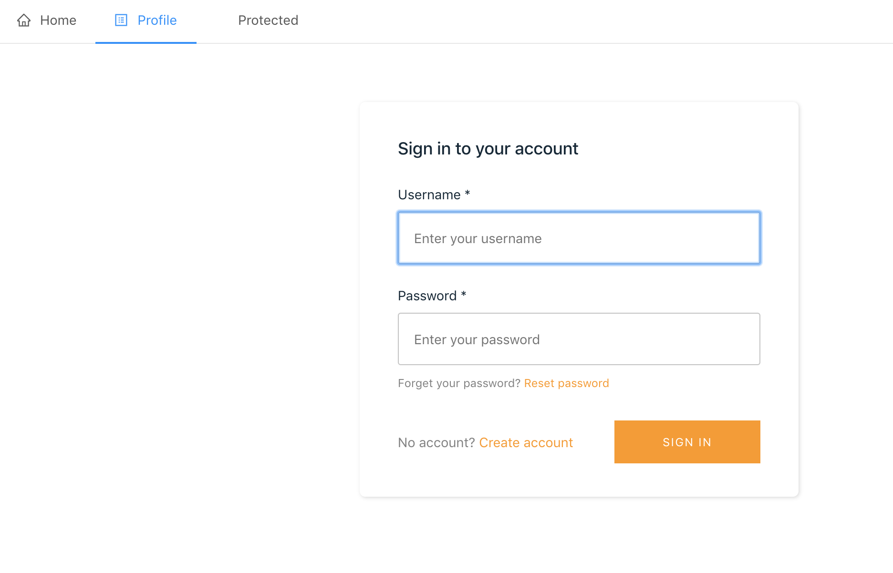

# Chapter 5 - Custom Authentication

React app with custom authentication flow and hook based protected routes using AWS Amplify and React Router.



---

To run this app:

1. Clone the repository

```sh
git clone https://github.com/dabit3/full-stack-serverless-code.git
```

2. Change into the directory

```sh
cd custom-authentication
```

3. Install the dependencies

```sh
npm install

# or

yarn
```

4. Deploy the amplify project

```sh
amplify init

amplify push
```

5. Start the app

```sh
npm start
```